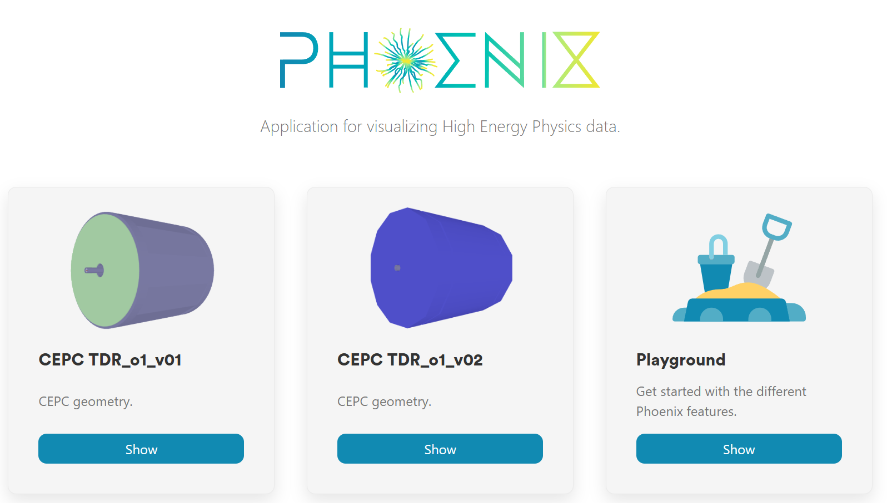
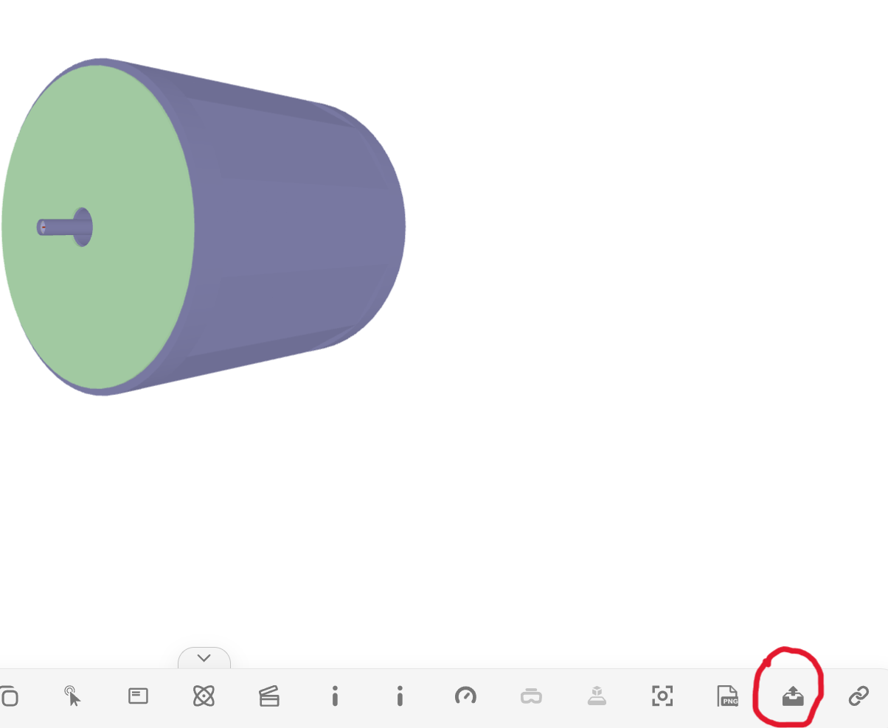
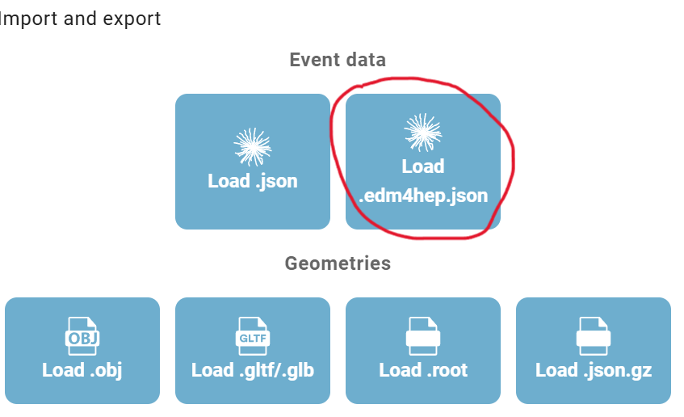
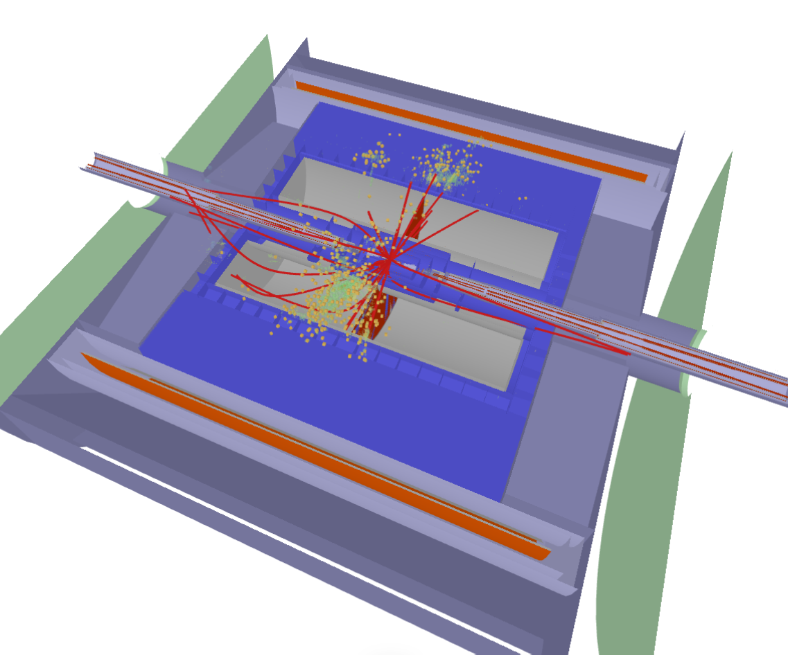

# User manual for CEPCSW users

* [Getting started](#getting-started)
* [Using Phoenix with your own data](#using-phoenix-with-your-own-data)
  * [CEPC Event data](#cepc-event-data)

## Getting started

### Open the application

You can both open the application locally or on online websites.

To open Phoenix for CEPC online, visit https://cepcvis.ihep.ac.cn/

To run the application locally, you could download the project via command:

```shell
git clone https://code.ihep.ac.cn/starr136a/phoenix.git
```

or just download the source code and unzip. Open the terminal in the root directory of the project, with Python installed, you could start a simple web server to run Phoenix:
```shell
python -m http.server 8080 --directory=docs
```
Open http://localhost:8080 in your web browser to run the application.

### The demo grid

When you first open the Phoenix, you will see a grid of Phoenix demos:



* **Playground** : a blank canvas where you can load 3D objects, move them around and generally experiment with Phoenix
* **Geometry display** : a simple demo of generating geometry procedurally/programmatically with Phoenix
* **ATLAS** : the ATLAS experiment demo. Here you can load `Phoenix JSON` or `JiveXML` event data files, and visualise physics objects such as Jets, Tracks, Calo cells etc within the ATLAS geometry.
* **LHCb** : the LHCb experiment demo shows a detailed view of the LHCb geometry, as well as tracks passing through it.
* **CMS** : the CMS experiment demo. Here you select from various event data files, and visualise physics objects such as Jets, Tracks, Calo cells etc within the CMS geometry. One special feature of the CMS demo is the visualisation of Muon Chambers.
* **TrackML** : this shows the imaginary detector created for the TrackML [challenges](https://www.kaggle.com/c/trackml-particle-identification).

Except for these, you will also see two additional demos for CEPC experiment:

* **CEPC TDR_o1_v01** : The CEPC experiment demo, which shows the CEPC detector geometry of version TDR_o1_v01
* **CEPC TDR_o1_v02** : The CEPC experiment demo, which shows the CEPC detector geometry of version TDR_o1_v02

## Using Phoenix with your own data

### CEPC Event data

To use Phoenix for your own event data, we will be working with files/programs stored on two computers. First computer will be the one which can source Key4hep stack, e.g. lxlogin.ihep.ac.cn and the second one will be yours with the recent web browser. We will call the first one the remote machine and the second one the local machine.
Firstly, source the Key4hep environment on the remote machine (using lxlogin.ihep.ac.cn as an example):
```shell
source /cvmfs/cepcsw.ihep.ac.cn/prototype/releases/externals/105.0.0/setup-105.0.0-el9.sh
```
If you have CEPC event data stored as edm4hep .root file, you can dump it to .edm4hep.json format using the following command:
```shell
edm4hep2json -e 0 rec_E91_bb_00393.root
```
The json format is very ineffective in storing information leading to very large file size, so here we used -e option to control which events will be dumped to JSON.
For example, if you want the first three events dumped into JSON, run:
```shell
edm4hep2json -e 0,1,2 rec_E91_bb_00393.root
```
Then download the dumped JSON file to your local directory.
To upload the .edm4hep.json file into the Phoenix use the upload button in the lover right corner of the web page:



and press the corresponding upload button in the dialog:



Once loaded, the detector and event geometry will look similar like this:



For more details about the general usage of Phoenix, you can visit [User manual](./guides/users.md)
